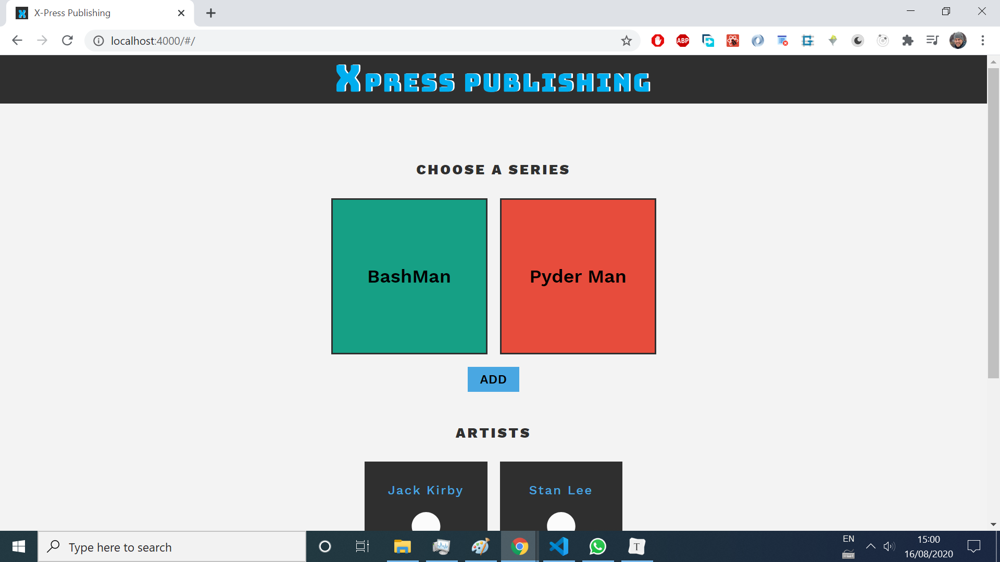
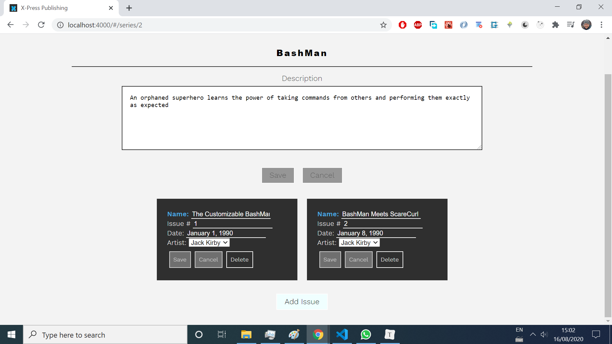
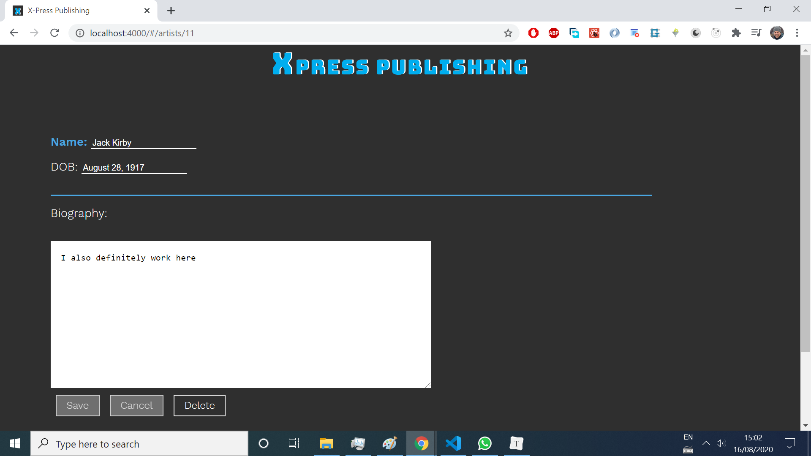

# X-Press Publishing

A full-stack **SERN** (SQL, [React](https://github.com/facebook/react),  [Express](https://www.npmjs.com/package/express), and [Node](https://nodejs.org/en/)) App that allows user to:
- Create, view, and update artists
- Create, view, update, and delete comic book series
- Create, view, update, and delete issues of a specific comic book series

To view all of this functionality in action, you can download and watch [this video]( https://s3.amazonaws.com/codecademy-content/programs/build-apis/solution-videos/XPressPublishing480.mov).

The files coded by the author are: `/api/api.js`, `/api/artists.js`, `/api/issues.js` and `migration.js`; basically, all the API endpoints, which interact with the database. The rest of the code was NOT coded by the author.


## Table of contents

* [General info](#general-info)
* [Screenshots](#screenshots)
* [Technologies](#technologies)
* [Setup](#setup)
* [API Features](#api-features)
* [Status](#status)
* [Inspiration](#inspiration)
* [Contact](#contact)


## General info

This project was coded to learn how to write API endpoints with [Express](https://www.npmjs.com/package/express) and interact with a SQL database via [sqlite3](https://www.npmjs.com/package/sqlite3) npm package.


## Screenshots

Image#1: Home screen




Image#2:  Series screen




Image#3: Artists screen




## Technologies

* [React](https://github.com/facebook/react) - version 15.6.1,
* [Express](https://www.npmjs.com/package/express): -version 4.17.1,
* [Sqlite3](https://www.npmjs.com/package/sqlite3) :  -version 4.1.1,
* [Node](https://nodejs.org/en/): -version 12.16.1


## Setup

* **Clone or download the repo.**

* **Install all the dependencies** listed on the`package.json` file by running:

  ```bash
  npm install
  ```

* **Run the `server.js` file**:

  ```bash
  node server
  ```

* Now the app is served on https://localhost:4000

* If you want to **pre-populate the database** with some dummy data, run `seed.js` file:

  ````
  node seed
  ````

* To **test the endpoints**:

  ```
  npm test
  ```

   You will see a list of tests that ran with information about whether or not each test passed. After this list, you will see more specific output about why each failing test failed.


## API Features

**`/api/artists`**

- GET
  - Returns a 200 response containing all saved currently-employed artists (`is_currently_employed` is equal to `1`) on the `artists` property of the response body
- POST
  - Creates a new artist with the information from the `artist` property of the request body and saves it to the database. Returns a 201 response with the newly-created artist on the `artist` property of the response body
  - If any required fields are missing, returns a 400 response

**`/api/artists/:artistId`**

- GET
  - Returns a 200 response containing the artist with the supplied artist ID on the `artist` property of the response body
  - If an artist with the supplied artist ID doesn't exist, returns a 404 response
- PUT
  - Updates the artist with the specified artist ID using the information from the `artist` property of the request body and saves it to the database. Returns a 200 response with the updated artist on the `artist` property of the response body
  - If any required fields are missing, returns a 400 response
  - If an artist with the supplied artist ID doesn't exist, returns a 404 response
- DELETE
  - Updates the artist with the specified artist ID to be unemployed (`is_currently_employed` equal to `0`). Returns a 200 response.
  - If an artist with the supplied artist ID doesn't exist, returns a 404 response

**`/api/series`**

- GET
  - Returns a 200 response containing all saved series on the `series` property of the response body
- POST
  - Creates a new series with the information from the `series` property of the request body and saves it to the database. Returns a 201 response with the newly-created series on the `series` property of the response body
  - If any required fields are missing, returns a 400 response

**/api/series/:seriesId**

- GET
  - Returns a 200 response containing the series with the supplied series ID on the `series` property of the response body
  - If a series with the supplied series ID doesn't exist, returns a 404 response
- PUT
  - Updates the series with the specified series ID using the information from the `series` property of the request body and saves it to the database. Returns a 200 response with the updated series on the `series` property of the response body
  - If any required fields are missing, returns a 400 response
  - If a series with the supplied series ID doesn't exist, returns a 404 response
- DELETE
  - Deletes the series with the supplied series ID from the database if that series has no related issues. Returns a 204 response.
  - If the series with the supplied series ID has related issues, returns a 400 response.
  - If a series with the supplied series ID doesn't exist, returns a 404 response

**`/api/series/:seriesId/issues`**

- GET
  - Returns a 200 response containing all saved issues related to the series with the supplied series ID on the `issues` property of the response body
  - If a series with the supplied series ID doesn't exist, returns a 404 response
- POST
  - Creates a new issue, related to the series with the supplied series ID, with the information from the `issue` property of the request body and saves it to the database. Returns a 201 response with the newly-created issue on the `issue` property of the response body
  - If any required fields are missing or an artist with the supplied artist ID doesn't exist, returns a 400 response
  - If a series with the supplied series ID doesn't exist, returns a 404 response

**`/api/series/:seriesId/issues/:issueId`**

- PUT
  - Updates the issue with the specified issue ID using the information from the `issue` property of the request body and saves it to the database. Returns a 200 response with the updated issue on the `issue` property of the response body
  - If any required fields are missing, returns a 400 response
  - If a series with the supplied series ID doesn't exist, returns a 404 response
  - If an issue with the supplied issue ID doesn't exist, returns a 404 response
- DELETE
  - Deletes the issue with the supplied issue ID from the database. Returns a 204 response.
  - If a series with the supplied series ID doesn't exist, returns a 404 response
  - If an issue with the supplied issue ID doesn't exist, returns a 404 response


## Status

Project is _finished_. 


## Inspiration

This project was based on [CodeCademy's Web Development career path](https://www.codecademy.com/learn/paths/web-development)


## Contact

Created by [Esteban Munch Jones](https://www.linkedin.com/in/estebanmunchjones/)- feel free to contact me.
